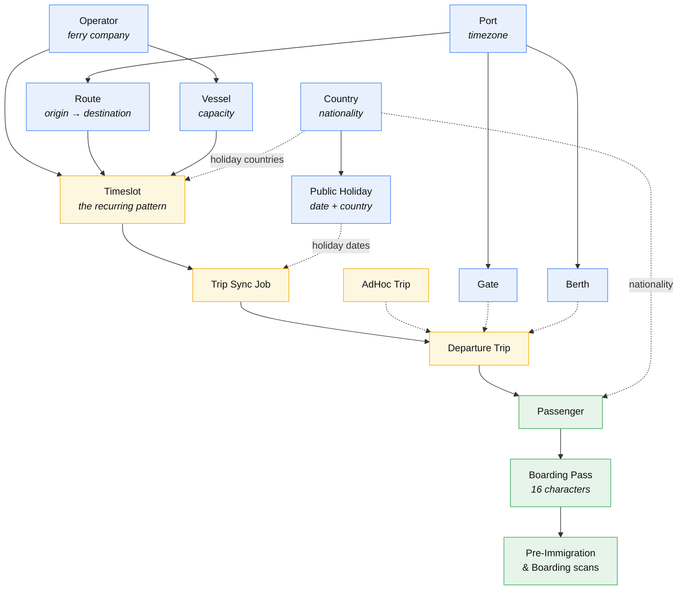
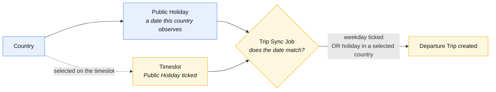
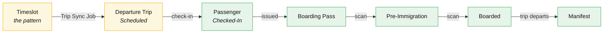

Most of the rules you will meet in this system come from **one idea**: records depend
on other records. A vessel belongs to an operator. A route joins two ports. A timeslot
needs all three.

Understanding that map answers two questions at once:

- **What order do I set things up in?** — you cannot create a timeslot before its
  operator, route, and vessel exist.
- **Why won't the system let me delete this?** — because something else is still
  using it.

This page is the map. Every box links to its own guide.

## The dependency map

**Solid arrows** mean *required* — the target cannot exist without the source.
**Dotted arrows** mean *used by* — an optional or run-time link.

The colours group the records into the three layers you work in:
**blue** is master data you set up once, **amber** is scheduling, and **green** is the
day-of-departure operation.

Read it top to bottom and you have the setup order. Read an arrow backwards and you
have the reason a deletion was blocked.

:::note[Country sits in the middle of two very different things]
**Countries** are used for **passenger nationality** and document issuing country
**and** as the owner of **public holidays** — which is how the system knows a Singapore
holiday from an Indonesian one. That second role is explained in
[Public holidays are per country](#public-holidays-are-per-country) below.
:::

## Setting up a new terminal, in order

Work down this list. Each step only needs the steps above it.

| # | Create | Needs first | Guide |
| --- | --- | --- | --- |
| 1 | **Ports** | — | [Ports](/terminal-staff/ports) |
| 2 | **Gates** and **Berths** | A port | [Gates](/terminal-staff/gates) · [Berths](/terminal-staff/berths) |
| 3 | **Routes** | Two *different* ports | [Routes](/terminal-staff/routes) |
| 4 | **Operators** | — | [Operators](/terminal-staff/operators) |
| 5 | **Vessels** | An operator | [Vessels](/terminal-staff/vessels) |
| 6 | **Countries** | — | [Countries](/terminal-staff/countries) |
| 7 | **Public Holidays** | **A country** | [Public Holiday](/terminal-staff/public-holiday) |
| 8 | **Timeslots** | Operator + route + **active** vessel, and **countries** if it runs on holidays | [Timeslots](/terminal-staff/timeslots) |
| 9 | **Departure Trips** | Timeslots (via a sync job) | [Trip Sync Job](/trip-sync-job) |

Steps 1–3, 4–5, and 6–7 are three independent chains — you can do them in any order.
They only have to meet before step 8.

:::tip[Activate as you go]
New **vessels** and **operators** are created **Inactive**. Pickers elsewhere in the
system list **active** records only — so a vessel you just created will not appear in
the timeslot's **Default Vessel** list until you activate it. Activate each record as
you create it and you will avoid the most common set-up confusion.
:::

## Public holidays are per country

This matters for any terminal running **international** sailings, where the two ends of
a route do not share a holiday calendar.

- **A public holiday belongs to one country.** You record it as a **date**, a
  **description**, and the **country** that observes it. The same calendar date can be a
  holiday in two countries — that is simply two records. You cannot record the same date
  twice for the *same* country.
- **A timeslot names the countries whose holidays it follows.** When you tick
  **Public Holiday** on a timeslot, you must also select **at least one country**. That
  is what tells the system *whose* holidays this service runs on.

### How a holiday changes the schedule

The rule the [Trip Sync Job](/trip-sync-job) applies is **additive**:

> A timeslot runs on its **ticked weekdays**, **and additionally** on any date that
> **one of its selected countries** observes as a public holiday.

Two consequences worth knowing:

- **A holiday does not cancel the normal timetable.** Public-holiday timeslots are
  *added* to whatever already runs that weekday — they do not replace or suppress it. If
  you want a reduced holiday service, that is a scheduling decision you make in your
  timeslots, not something the system does for you.
- **A holiday in a country the timeslot did not select changes nothing.** Selecting the
  countries is what activates the behaviour.

:::warning[Validation you will meet]
- Ticking **Public Holiday** on a timeslot without choosing a country →
  _"At least one country is required when the timeslot runs on public holidays."_
- Recording the same date twice for one country →
  _"A public holiday already exists for this date and country."_
- Deleting a country still in use →
  _"Cannot delete Country because it has public holidays."_ or
  _"Cannot delete Country because departure timeslots run on its public holidays."_
:::

## What each record is

| Record | In plain terms | Requires | Blocks deletion while… |
| --- | --- | --- | --- |
| **[Port](/terminal-staff/ports)** | A terminal, with its own timezone and clock | — | it has berths, or is used by routes |
| **[Gate](/terminal-staff/gates)** | Where passengers board, within a port | A port | — |
| **[Berth](/terminal-staff/berths)** | Where the vessel ties up, within a port | A port | — |
| **[Route](/terminal-staff/routes)** | Origin → destination (must differ) | Two ports | it is used by timeslots, trips, or sync jobs |
| **[Operator](/terminal-staff/operators)** | A ferry company | — | it has vessels, timeslots, or trips |
| **[Vessel](/terminal-staff/vessels)** | A ferry, carrying a **capacity** | An operator | it is assigned to scheduled trips |
| **[Country](/terminal-staff/countries)** | Passenger **nationality** and document issuing country — **and** the owner of public holidays | — | it has public holidays, or timeslots run on its holidays |
| **[Public Holiday](/terminal-staff/public-holiday)** | A date **one country** observes | **A country** | — |
| **[Timeslot](/terminal-staff/timeslots)** | The *recurring pattern* — "this operator, this route, departs 11:20 on these days" | Operator + route + active vessel (+ countries if it runs on holidays) | — |
| **[Departure Trip](/terminal-staff/departure-trips)** | One real sailing on one date | A timeslot (or created directly as AdHoc) | — |
| **[Passenger](/terminal-staff/passengers)** | One person on one trip | A trip with a free seat, and a nationality | — |

:::info[Deactivate rather than delete]
Where history matters, the system steers you toward **Inactive** instead of **Delete** —
an inactive record keeps every trip and passenger that already references it, while
disappearing from new selections. That is why most "cannot delete" messages suggest
deactivating instead.
:::

## From a schedule to a boarded passenger

The master data above exists to produce **trips**, and trips exist to carry
**passengers**. That path runs like this:

A few things worth knowing about that path:

- **A timeslot is not a trip.** The timeslot is the rule; the
  [Trip Sync Job](/trip-sync-job) turns it into dated, bookable trips. Running the same
  job twice changes nothing.
- **A trip's code describes it** — operator trip code, route trip code, date, departure
  time, and the timeslot's suffix.
- **The boarding pass is the key to everything operational.** It is 16 characters,
  issued per passenger at check-in, and it is the only thing the gate needs — both the
  [pre-immigration](/terminal-staff/pre-immigration-scan) and
  [boarding](/terminal-staff/boarding-scan) scans work from it alone.
- **A trip needs a gate and a berth before it can board** — they are assigned when the
  trip is [set to Boarding](/terminal-staff/manage-departure-trip#1-set-as-boarding),
  not when it is created.
- **Capacity comes from the vessel.** Check-in is refused once the seats are gone, and
  a vessel cannot be swapped onto a trip that already carries more passengers than the
  new vessel holds.

## Who manages what

Two portals share this data, but they do not share responsibility for it.

| Managed by | Records |
| --- | --- |
| **Terminal staff** | Ports, gates, berths, routes, countries, public holidays, operators, vessels, timeslots, and trip sync jobs |
| **Ferry operators** | Their own users and roles, their passengers' check-in, and the vessel assigned to their trips |
| **The system** | Scheduled trips (from sync jobs), trip codes, and boarding pass numbers |

Two rules follow from this table:

- **Operators see only their own data.** Trips, vessels, and passengers are scoped to
  the operator you are signed in as — there is no view across operators.
- **The terminal sees every operator at its port**, because the terminal runs the port.

Master data an operator can see — such as their [timeslots](/ferry-operator/operator-timeslots)
and [passengers](/ferry-operator/operator-passengers) — is **read-only** to them.
Changes are made by terminal staff.

## Where to go next

- Setting up for the first time → start at [Ports](/terminal-staff/ports) and follow the
  order above.
- Already set up, need trips → [Timeslots](/terminal-staff/timeslots) then
  [Trip Sync Job](/trip-sync-job).
- Running trips today → [Manage Current Trip Status](/terminal-staff/manage-departure-trip).
- A ferry operator → [Sign In to the Operator Portal](/ferry-operator/operator-sign-in).
