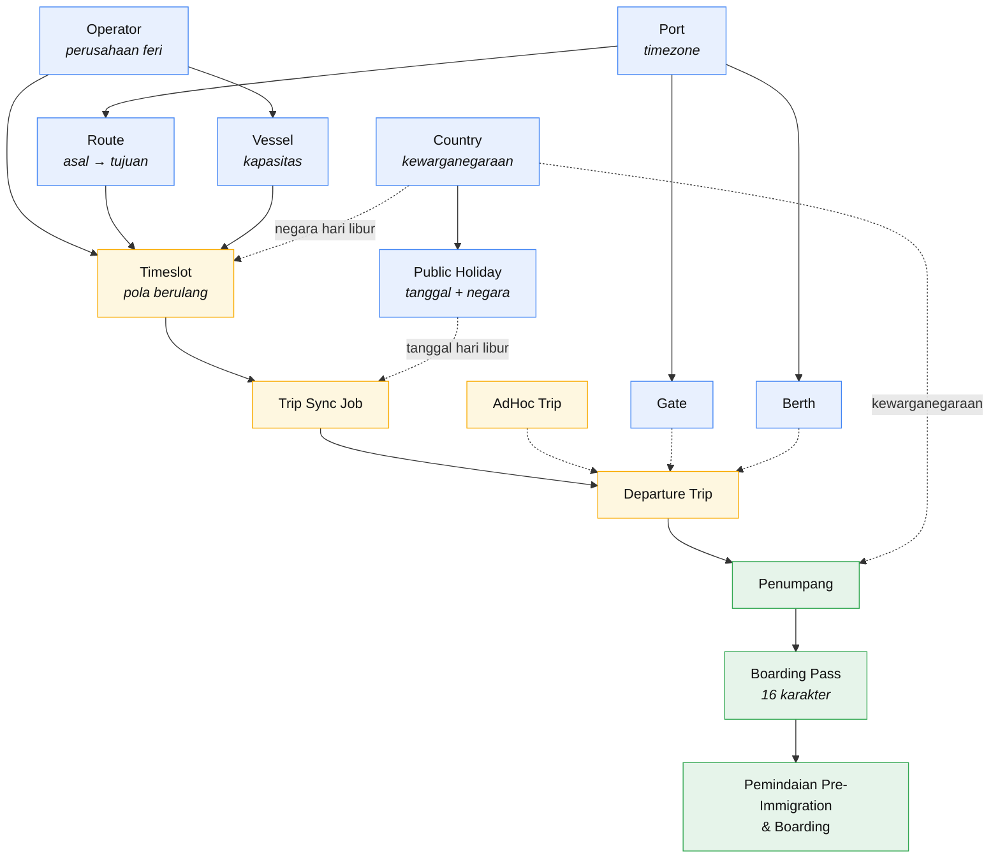
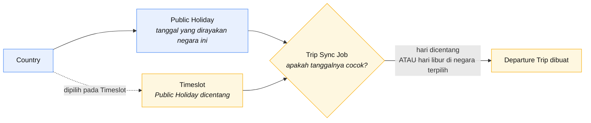
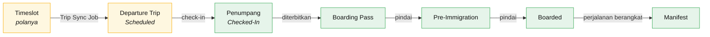

Sebagian besar aturan yang Anda temui di sistem ini berasal dari **satu gagasan**:
data bergantung pada data lain. Vessel milik sebuah operator. Route menghubungkan
dua Port. Timeslot membutuhkan ketiganya.

Memahami peta itu menjawab dua pertanyaan sekaligus:

- **Dalam urutan apa saya menyiapkan semuanya?** — Anda tidak dapat membuat Timeslot
  sebelum operator, Route, dan Vessel-nya ada.
- **Mengapa sistem tidak mengizinkan saya menghapus ini?** — karena ada hal lain yang
  masih memakainya.

Halaman ini adalah petanya. Setiap kotak menautkan ke panduannya sendiri.

## Peta Ketergantungan {/* #the-dependency-map */}

**Panah utuh** berarti *wajib* — target tidak dapat ada tanpa sumbernya. **Panah
putus-putus** berarti *dipakai oleh* — hubungan opsional atau saat berjalan.

Warnanya mengelompokkan data ke dalam tiga lapisan tempat Anda bekerja: **biru**
adalah data master yang diatur sekali, **kuning** adalah penjadwalan, dan **hijau**
adalah operasional hari keberangkatan.

Baca dari atas ke bawah dan Anda mendapat urutan penyiapannya. Baca panah secara
terbalik dan Anda mendapat alasan sebuah penghapusan diblokir.

:::note[Country berada di tengah dua hal yang sangat berbeda]
**Countries** dipakai untuk **kewarganegaraan penumpang** dan negara penerbit dokumen
**sekaligus** sebagai pemilik **hari libur nasional** — begitulah sistem membedakan
hari libur Singapura dari hari libur Indonesia. Peran kedua dijelaskan di
[Hari libur nasional berlaku per negara](#public-holidays-are-per-country) di bawah.
:::

## Menyiapkan Terminal Baru, Secara Berurutan {/* #setting-up-a-new-terminal-in-order */}

Ikuti daftar ini dari atas. Setiap langkah hanya membutuhkan langkah di atasnya.

| # | Buat | Yang dibutuhkan lebih dulu | Panduan |
| --- | --- | --- | --- |
| 1 | **Ports** | — | [Ports](/terminal-staff/ports) |
| 2 | **Gates** dan **Berths** | Satu Port | [Gates](/terminal-staff/gates) · [Berths](/terminal-staff/berths) |
| 3 | **Routes** | Dua Port yang *berbeda* | [Routes](/terminal-staff/routes) |
| 4 | **Operators** | — | [Operators](/terminal-staff/operators) |
| 5 | **Vessels** | Satu operator | [Vessels](/terminal-staff/vessels) |
| 6 | **Countries** | — | [Countries](/terminal-staff/countries) |
| 7 | **Public Holidays** | **Satu negara** | [Hari Libur Nasional](/terminal-operator/configure-public-holiday) |
| 8 | **Timeslots** | Operator + Route + Vessel **aktif**, dan **negara** jika berjalan di hari libur | [Timeslot](/terminal-operator/create-timeslot) |
| 9 | **Departure Trips** | Timeslot (melalui sync job) | [Trip Sync Job](/terminal-operator/generate-trips) |

Langkah 1–3, 4–5, dan 6–7 adalah tiga rantai yang terpisah — Anda dapat
mengerjakannya dalam urutan mana pun. Ketiganya hanya perlu bertemu sebelum langkah
8.

:::tip[Aktifkan sambil berjalan]
**Vessel** dan **operator** baru dibuat dalam keadaan **Inactive**. Pemilih di bagian
lain sistem hanya menampilkan data **aktif** — jadi Vessel yang baru dibuat tidak
akan muncul di daftar **Default Vessel** Timeslot sampai Anda mengaktifkannya.
Aktifkan setiap data saat Anda membuatnya dan Anda akan terhindar dari kebingungan
penyiapan yang paling umum.
:::

## Hari Libur Nasional Berlaku per Negara {/* #public-holidays-are-per-country */}

Ini penting bagi terminal yang menjalankan pelayaran **internasional**, di mana kedua
ujung Route tidak berbagi kalender hari libur yang sama.

- **Hari libur nasional milik satu negara.** Anda mencatatnya sebagai **tanggal**,
  **deskripsi**, dan **negara** yang merayakannya. Tanggal kalender yang sama bisa
  menjadi hari libur di dua negara — itu cukup dua data. Anda tidak dapat mencatat
  tanggal yang sama dua kali untuk negara yang *sama*.
- **Timeslot menyebutkan negara yang hari liburnya diikuti.** Saat Anda mencentang
  **Public Holiday** pada Timeslot, Anda juga harus memilih **setidaknya satu
  negara**. Itulah yang memberi tahu sistem hari libur *negara mana* yang diikuti
  layanan ini.

### Bagaimana Hari Libur Mengubah Jadwal {/* #how-a-holiday-changes-the-schedule */}

Aturan yang diterapkan [Trip Sync Job](/terminal-operator/generate-trips) bersifat
**menambah**:

> Timeslot berjalan pada **hari-hari yang dicentang**, **dan sebagai tambahan** pada
> tanggal mana pun yang dirayakan sebagai hari libur nasional oleh **salah satu
> negara yang dipilihnya**.

Dua akibat yang perlu diketahui:

- **Hari libur tidak membatalkan jadwal normal.** Timeslot hari libur *ditambahkan* ke
  apa pun yang sudah berjalan pada hari itu — tidak menggantikan atau menekannya. Jika
  Anda menginginkan layanan hari libur yang dikurangi, itu keputusan penjadwalan yang
  Anda buat di Timeslot, bukan sesuatu yang dilakukan sistem untuk Anda.
- **Hari libur di negara yang tidak dipilih Timeslot tidak mengubah apa pun.** Memilih
  negara itulah yang mengaktifkan perilaku ini.

:::warning[Validasi yang akan Anda temui]
- Mencentang **Public Holiday** pada Timeslot tanpa memilih negara →
  _"At least one country is required when the timeslot runs on public holidays."_
- Mencatat tanggal yang sama dua kali untuk satu negara →
  _"A public holiday already exists for this date and country."_
- Menghapus negara yang masih dipakai →
  _"Cannot delete Country because it has public holidays."_ atau
  _"Cannot delete Country because departure timeslots run on its public holidays."_
:::

## Arti Setiap Data {/* #what-each-record-is */}

| Data | Dalam bahasa sederhana | Membutuhkan | Memblokir penghapusan selama… |
| --- | --- | --- | --- |
| **[Port](/terminal-staff/ports)** | Sebuah terminal, dengan timezone dan jamnya sendiri | — | masih memiliki Berth, atau dipakai oleh Route |
| **[Gate](/terminal-staff/gates)** | Tempat penumpang naik, di dalam satu Port | Satu Port | — |
| **[Berth](/terminal-staff/berths)** | Tempat kapal bersandar, di dalam satu Port | Satu Port | — |
| **[Route](/terminal-staff/routes)** | Asal → tujuan (harus berbeda) | Dua Port | masih dipakai oleh Timeslot, perjalanan, atau sync job |
| **[Operator](/terminal-staff/operators)** | Sebuah perusahaan feri | — | masih memiliki Vessel, Timeslot, atau perjalanan |
| **[Vessel](/terminal-staff/vessels)** | Sebuah kapal feri, dengan **kapasitas** | Satu operator | masih ditetapkan ke perjalanan terjadwal |
| **[Country](/terminal-staff/countries)** | **Kewarganegaraan** penumpang dan negara penerbit dokumen — **sekaligus** pemilik hari libur nasional | — | masih memiliki hari libur, atau ada Timeslot yang berjalan di hari liburnya |
| **[Public Holiday](/terminal-operator/configure-public-holiday)** | Tanggal yang dirayakan **satu negara** | **Satu negara** | — |
| **[Timeslot](/terminal-operator/create-timeslot)** | *Pola berulang* — "operator ini, Route ini, berangkat 11:20 di hari-hari ini" | Operator + Route + Vessel aktif (+ negara jika berjalan di hari libur) | — |
| **[Departure Trip](/terminal-operator/create-ad-hoc-trip)** | Satu pelayaran nyata pada satu tanggal | Satu Timeslot (atau dibuat langsung sebagai AdHoc) | — |
| **[Penumpang](/terminal-operator/look-up-passenger)** | Satu orang di satu perjalanan | Perjalanan dengan kursi kosong, dan kewarganegaraan | — |

:::info[Nonaktifkan, jangan hapus]
Jika riwayat penting, sistem mengarahkan Anda ke **Inactive** alih-alih **Delete** —
data yang tidak aktif tetap menyimpan setiap perjalanan dan penumpang yang
merujuknya, sambil hilang dari pilihan baru. Itulah sebabnya sebagian besar pesan
"cannot delete" menyarankan untuk menonaktifkan.
:::

## Dari Jadwal sampai Penumpang Naik {/* #from-a-schedule-to-a-boarded-passenger */}

Data master di atas ada untuk menghasilkan **perjalanan**, dan perjalanan ada untuk
membawa **penumpang**. Alurnya seperti ini:

Beberapa hal yang perlu diketahui tentang alur itu:

- **Timeslot bukan perjalanan.** Timeslot adalah aturannya;
  [Trip Sync Job](/terminal-operator/generate-trips) mengubahnya menjadi perjalanan
  bertanggal yang dapat dipesan. Menjalankan job yang sama dua kali tidak mengubah
  apa pun.
- **Kode perjalanan menggambarkan perjalanannya** — trip code operator, trip code
  Route, tanggal, jam keberangkatan, dan suffix Timeslot.
- **Boarding pass adalah kunci semua kegiatan operasional.** Panjangnya 16 karakter,
  diterbitkan per penumpang saat check-in, dan hanya itu yang dibutuhkan Gate — baik
  pemindaian [Pre-Immigration](/terminal-operator/pre-immigration-scan) maupun
  [Boarding](/terminal-operator/boarding-scan) bekerja hanya dengannya.
- **Perjalanan membutuhkan Gate dan Berth sebelum dapat Boarding** — keduanya
  ditetapkan saat perjalanan
  [diatur menjadi Boarding](/terminal-operator/set-trip-as-boarding), bukan saat
  dibuat.
- **Kapasitas berasal dari Vessel.** Check-in ditolak setelah kursi habis, dan Vessel
  tidak dapat diganti ke perjalanan yang sudah membawa penumpang lebih banyak dari
  daya tampung Vessel baru.

## Siapa Mengelola Apa {/* #who-manages-what */}

Dua portal berbagi data ini, tetapi tidak berbagi tanggung jawab atasnya.

| Dikelola oleh | Data |
| --- | --- |
| **Staf terminal** | Port, Gate, Berth, Route, negara, hari libur nasional, operator, Vessel, Timeslot, dan Trip Sync Job |
| **Operator feri** | Pengguna dan role mereka sendiri, check-in penumpang mereka, dan Vessel yang ditetapkan ke perjalanan mereka |
| **Sistem** | Perjalanan terjadwal (dari sync job), kode perjalanan, dan nomor boarding pass |

Dua aturan muncul dari tabel ini:

- **Operator hanya melihat datanya sendiri.** Perjalanan, Vessel, dan penumpang
  dibatasi ke operator tempat Anda masuk — tidak ada tampilan lintas operator.
- **Terminal melihat semua operator di Port-nya**, karena terminal yang menjalankan
  Port tersebut.

Data master yang dapat dilihat operator — seperti
[Timeslot](/ferry-operator/look-up-timeslot) dan
[penumpang](/ferry-operator/look-up-passenger) mereka — bersifat **read-only** bagi
mereka. Perubahan dilakukan oleh staf terminal.

## Ke Mana Selanjutnya {/* #where-to-go-next */}

- Menyiapkan untuk pertama kali → mulai dari [Ports](/terminal-staff/ports) dan ikuti
  urutan di atas.
- Sudah siap, butuh perjalanan → [Timeslot](/terminal-operator/create-timeslot) lalu
  [Trip Sync Job](/terminal-operator/generate-trips).
- Menjalankan perjalanan hari ini →
  [Mengatur Perjalanan menjadi Boarding](/terminal-operator/set-trip-as-boarding).
- Operator feri → [Masuk ke Operator Portal](/ferry-operator/sign-in).
